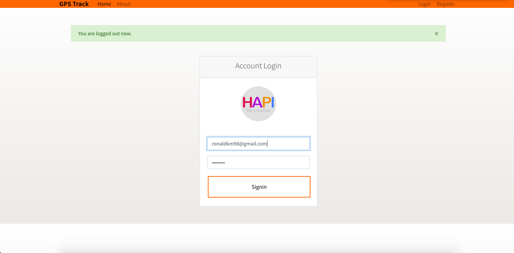
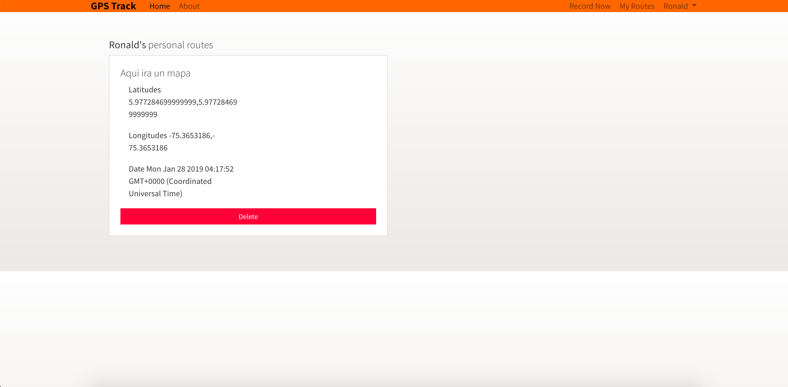

# GPS Track with Node, Mongodb
This is a basic App to monitor and save GPS routes from a mobile device.
This app can*:
- Record a route from a mobile device in real time
- Share/see/delete routes
- Allows a user to log in and save his personal routes

## Getting Started
These instructions will get you a copy of the project up and running on your local machine for development and testing purposes. For deployment on a live enviroment please refer to the Deployment section.

### Prerequisites
To run this project locally you must have installed,

* [npm and node](https://docs.npmjs.com/getting-started/installing-node)
* [mongodb](https://docs.mongodb.com/manual/installation/)

## Design

### Models
Everything is stored in Javascript Schema objects, for example this is the User's model
```
const UserSchema = new Schema({
  name: { type: String, required: true },
  email: { type: String, required: true },
  password: { type: String, required: true },
  date: { type: Date, default: Date.now }
});
```

Then objects are represented in the Javascript Object Notation: 
```
 {
    name: String,
    email: Number,
    password: Number,
    date: { type: Date, default: Date.now},
 }
```

## Installing

### Installing MongoDB
* [MongoDB](https://docs.mongodb.com/manual/installation/) is the Database Framework used by GPSTrack. You can follow the instrucions to install MongoDB in your
  system.

### Installing GPSTrack
Here you have a step by step guide to get te app up and running on your local machine, for a deploy on a live 
enviroment please refer to the Deployment section.

* Clone the project's repo
```
$git clone https://github.com/ronaldKM98/TET.git
```
* Go to the project's root directory /TET/gpstrack/
```
$cd TET/gpstrack
```

* Once in the project directory execute the following command to install dependencies
```
$npm install 
```

### Installing nginx
* [Installing Nginx](https://www.nginx.com/resources/wiki/start/topics/tutorials/install/) on your local system.

## Execution
* Now you can run the app on your local machine, first verify that the Mongo and Nginx services are up and running and
check that port 3000 is free to use.
```
$sudo service mongod start
$sudo service nginx start
$npm start
```

* If it worked, you shoud see the following message in your terminal: 
```
> nodejs-notes-app@1.0.0 start /Users/ronald/Documents/Docker/gpstrack
> nodemon src/index.js

[nodemon] 1.18.9
[nodemon] to restart at any time, enter `rs`
[nodemon] watching: *.*
[nodemon] starting `node src/index.js`
Server on port 4000
DB is connected
```

### Running the tests
By now we don't have implemented automated tests but you can visit http://localhost:4000/ to start consuming the web services
. Preferably using Google Chrome or Mozilla Firefox.

## Deployment
There are already running instances of GPSTrack live at EAFIT University's DCA and an Amazon Web Services EC2 Virtual Machine.
* [EAFIT University's DCA Testing Enviroment](https://rcardo11.dis.eafit.edu.co/) -- In this case and by the moment you should trust the certificate warning that your browser is going to pop up.
* [AWS EC2 Production Enviroment](ec2-54-210-60-82.compute-1.amazonaws.com)

## Deploy your own instance using Docker
First of all you'll need to setup a new virtual machine in AWS by following the instructions in this [video](https://drive.google.com/file/d/1ITGHTak0gdUv3m1izGxQM0eNpNmvvNuU/view).

[Docker](https://www.docker.com/) is a container manager that among other things, allows you to migrate apps easily. Because of Docker portability the deployment steps are almost the same in DCA and AWS. Fortunately we have all settled up in the docker-compose file that you should see in the project's root directory, and all you've got to do is: 
* [Install Docker CE](https://docs.docker.com/install/) by following the instructions for your current system.
* Get docker-compose
```
$ sudo curl -L https://github.com/docker/compose/releases/download/1.24.0-rc1/docker-compose-`uname -s`-`uname -m` -o /usr/local/bin/docker-compose

$ sudo chmod +x /usr/local/bin/docker-compose
$ sudo usermod -aG docker user
```
Where user is your username in the host machine

* Make sure that the installation was successful and the Docker daemon is running
```
$docker-compose --version
$sudo service docker start
$sudo service docker status
```

* Then compile the application
```
$docker-compose build
```

* If everything went Ok now you can start the application
```
$docker-compose up -d
```
* Go to localhost:4000 to check.

### Obtain a domain for the App.
In this step we are going to assign a meaningul domain name to our app, so that we can access it via [ec2-3-92-40-246.compute-1.amazonaws.com](ec2-3-92-40-246.compute-1.amazonaws.com) or via a dedicated domain like [myapp.com](myapp.com). To do this we are going to obtain a free domain from [dot.tk](dot.tk) and map that name to our public ip address from AWS.

* Go to [dot.tk](dot.tk) or your favorite domain name provider and obtain a domain name of your preference.
* Then go to your AWS console and select the VM where your dockerized app is running and from the description tab copy the IPv4 Public IP.
* In the [domain provider's config site] (https://my.freenom.com/clientarea.php?action=products) select your app's domain and click manage domain.
* In the two boxes below paste you IPv4 Public IP and click save.
* Wait a moment and access your domain from a web browser and it should redirect to your AWS web server.

## Built With

* npm 5.60
* node v8.2.1
* mongod v3.6.2

## Authors

* **Ronald Cardona Martínez**

## Screenshots



